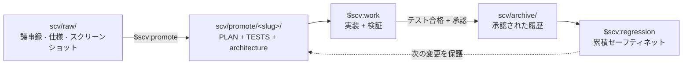

<div align="center">


# SCV for Codex

**Standard · Cowork · Verify**

**チーム向けのプロセス中心 Codex プラグイン。すべての変更にプランと
テストを付け、承認済みテストを継続的な回帰セーフティネットにします。**

資料投入 → Codex と一緒にプランへ精製 → 実装と検証 → プランとテストを
archive → 今後の変更をこれまで出荷した挙動と照合します。

[最新リリース](https://github.com/wookiya1364/scv-codex/releases/latest) ·
[English](./README.md) · [한국어](./README.ko.md)

</div>

---

## クイックスタート

SCV には自然言語で依頼できます。たとえば **「SCV でこのプロジェクトを
診断し、次にすることを教えて」** と頼むと、Codex が対応する skill へ
route します。

```bash
# 1. このリポジトリを Codex plugin marketplace として追加します。
codex plugin marketplace add https://github.com/wookiya1364/scv-codex.git

# 2. marketplace から SCV をインストールします。
codex plugin add scv@scv-codex
```

インストールしたスキルを読み込むため、新しい Codex chat または CLI
session を開始してから自然言語で依頼します:

```text
SCV でこのプロジェクトを診断し、次にすることを教えて。
```

skill を正確に選びたい場合だけ、任意の selector
`$scv:<name>` を使用できます。

```text
$scv:help "払い戻しボタンを追加したい"
$scv:deck scv/promote/refund/PLAN.md
```

`$` 形式はインストール済み Codex skill の selector で、shell command
ではありません。`/scv:<name>` は Claude Code の slash-command 表記
なので、この plugin では使用しません。

### プラットフォーム前提

- macOS: `brew install bash` で Bash 4+ を一度インストールします。
- Linux / WSL: 通常 Bash 4+ が用意されています。
- Windows の PowerShell/cmd ネイティブ環境は未対応です。WSL または
  Git Bash を使用してください。
- `curl`, `git`, `jq`, `gh`（または `glab`）を推奨します。SCV は不足
  している依存関係を推測せず、明示的に報告します。

## 5 分ウォークスルー

シナリオ: 決済ページに払い戻しボタンを追加。

| 分 | 操作 | 結果 |
|---|---|---|
| 1 | 議事録、スクリーンショット、仕様を `scv/raw/` に置く | 元資料がリポジトリの近くに残ります。 |
| 2 | `$scv:promote` | `scv/promote/<slug>/` に `PLAN.md`, `TESTS.md`, `FEATURE_ARCHITECTURE.md` を生成します。 |
| 3 | `$scv:work <slug>` | Codex がプランを実装してテストし、設定されていれば UI 証拠を取得します。 |
| 4 | PR/MR をレビュー | プラン、テスト結果、外部参照、図、任意の GIF/動画が一緒に届きます。 |
| 5 | 承認して archive | プランは `scv/archive/` に移り、テストは `$scv:regression` に加わります。 |

どの段階でも `$scv:help` がリポジトリの状態を読み、次の操作を案内します。

## ループ



archive は墓場ではありません。6 か月後、誰も覚えていない機能を壊しても、
その機能のテストが回帰を検出します。SCV を長く使うほどチームの
セーフティネットは厚くなります。

### archive がテスト以外に残すもの (Core 0.23.0+)

計画はどの道を行くかを書きます。`$scv:work` はより良い道を見つけたらそちらへ
進んでよい — なので後で知りたいのは計画が何と言ったかではなく、実際にはどこへ
進み、なぜそうしたかです。

archive 時にそれを `scv/DECISIONS.md` へ残します。

```markdown
## [2026-08-12 10:49] sspark — 返金フロー archived

- verdict: archived
- why: この計画が何を決め、実装して何が分かったか
- path delta: キューをやめて直接呼び出しにした — キューが必要だったのは
  リトライだけで、API はすでに冪等だった
- refs: scv/archive/20260812-sspark-refund-flow/PLAN.md
```

`path delta` は放っておけばセッションと共に消える一行です。計画どおりなら一語で
終わります — `as planned`。

### `$scv:work` が実装時に守ること (Core 0.23.0+)

計画の `Guardrails` が別を指示しない限り、4 つが既定です。すでに一つのやり方が
ある処理に二つ目を作らず、既存コードを再利用します。現在の要求を完全に満たす
最も単純な実装を選びます。関心事ひとつにつきコンポーネントひとつを保ちます。
元に戻すのが高くつく決定 (データモデル・モジュール境界・公開契約) は長期視点で
決めます。

説明も短い方を先に出します。追えない計画は承認できないので、質問・計画・進捗
報告は平易な説明から始め、求められたら深く入ります。

## スキル

この表を暗記する必要はありません。`$scv:help` がリポジトリの実際の
状態に合わせて案内します。

| スキル | 役割 |
|---|---|
| **`$scv:help`** | プロジェクト診断、自由形式アイデアの開始点作成、過去 archive の検索。 |
| `$scv:status` | raw 資料、進行中 promote、epic 進捗、workspace mode、受信 handoff を要約。 |
| `$scv:promote` | `scv/raw/` を承認可能なプラン、実行可能テスト、Mermaid architecture 図へ精製。 |
| `$scv:work <slug>` | プラン実装、テスト、証拠収集、承認、archive、PR/MR 準備。 |
| `$scv:codegen <slug>` | 実験的 TDD-first 変形。TESTS が case ごとの Red → Green を駆動し、archive/PR は `$scv:work` に引き継ぐ。 |
| `$scv:deck [<md>]` | 不足した事実を捏造せず、Markdown を self-contained 企画文書または DeckUI slide に変換。 |
| `$scv:update` | インストール版と release を比較し、Codex marketplace 更新コマンドを案内する read-only 検査。 |
| `$scv:regression` | obsolete でない全 archive の実行可能テスト手順を回帰 suite として実行。 |
| `$scv:routine <name>` | `scv/routines/` に定義された maintenance routine を 1 件実行、一覧表示（`--list`）、検査（`--lint <file>`）。スケジュール登録は常に host 所有。 |
| `$scv:report` | 明示的に設定された Slack または Discord 宛先へフェーズ結果を投稿。 |
| `$scv:sync` | 新しい SCV template を標準文書へ merge し、active plan・code scope・test 間の drift を検出。 |
| `$scv:install-deps` | 必須/任意 CLI を検出し、同意を得てインストール方法を案内。 |
| `$scv:workspace` | nested multi-repo umbrella workspace の作成、参加、確認、分離。 |
| `$scv:handoff` | 別 repo に必要な作業と判断/文脈を umbrella に記録。push と通知は同意がある場合のみ実行。 |
| `$scv:set-models` | 旧 `SCV_MODEL_POLICY` の意図を診断し、実際の Codex model 設定を説明。インストール済み skill は変更しない。 |

### Codex model policy の制約

Claude Code は command ごとの model metadata を許可しましたが、Codex
plugin skill は skill ごとの model pinning を提供しません。model は
host、session、project config の層で選択されます。そのため
`$scv:set-models` は完全に同一な router ではなく、**read-only の互換性
診断**として動作します。

`recommended`, `all-opus`, `all-sonnet`, `all-haiku`, `session-default`
の意図を解釈しますが、Anthropic model 名を OpenAI model 名へ推測で
置換しません。`.codex/config.toml` を変更するのは、ユーザーの明示的な
依頼、対応確認、変更 preview、再確認を経た場合だけです。

## なぜ SCV か

| チームの失敗モード | SCV の答え |
|---|---|
| AI diff を信頼する前に結局人が手動実行する。 | `$scv:work` が合意したテストを実行し、e2e 証拠を PR に添付できます。 |
| ticket、plan、PR、review が別々の変更を説明する。 | `PLAN.md` を単一 source とし、外部 ticket は `refs:` でリンクします。 |
| 過去の plan が検索されない archive になる。 | `supersedes:`, archive index, `$scv:help`, `$scv:regression` が履歴を生かします。 |
| 一つの hosted service や一人の maintainer に依存する。 | core は Bash と Markdown。plan と test は読み取り・fork 可能な repository file です。 |

Codex が主な実装パートナーで、変更が主に feature/fix/refactor 規模、
深い事前仕様より累積する回帰セーフティネットを重視するチームに適します。
大きな initiative は同じ `epic:` 配下の複数 slug に分割してください。

`TESTS.md` が backend、API、data、pure logic の挙動を精密に定義するなら
`$scv:codegen` が向きます。探索的 plan や visual intent をテストで十分
表せない UI 変更には `$scv:work` を推奨します。

## マルチリポジトリ

SCV はデフォルトで single-repository です。frontend、backend、service
など複数 repo のシステムでは、着脱可能な nested workspace を任意で
使用できます。

- `$scv:workspace` で umbrella 作成、child 参加、分離を行います。
- `$scv:handoff` で別 repo に必要な作業を明示的に宣言します。SCV は
  diff だけから cross-repo 要件を推論しません。
- handoff は `open → claimed → done` 状態と判断に至った会話を保持します。
- push 成功後の Slack/Discord 通知もユーザーの同意がある場合だけです。
- 複数の `scv/` がある monorepo では context または先頭引数で module
  を選べます。例: `$scv:status FE`, `$scv:work FE <slug>`.

workspace link を削除すれば local plan を migration せず standalone
SCV の動作へ戻ります。

## アーキテクチャと安全性

`PLAN.md` は source of truth、`TESTS.md` は実行 gate、
`FEATURE_ARCHITECTURE.md` は system view です。Jira、Linear、
Confluence、Google Docs、Notion の資料はコピーせず `refs:` でリンク
します。PR/MR 本文と Slack/Discord report は同じ plan から派生します。

明示的に呼び出した skill は作業のため file を読み書きできますが、外部
影響の大きい操作は可視化されます。

- archive にはテスト合格とユーザー承認が必要です。
- push、PR/MR 作成、通知、dependency install、永続 Codex config 変更
  には明示的な意図または確認が必要です。
- update と model-policy 検査は read-only です。
- archive は immutable。変更要件は新しい record で supersede します。

プロジェクトの `.env` に `SCV_LANG=en|ko|ja` を指定すると生成言語を
固定できます。未指定なら直近のユーザーメッセージに従い、判定できなければ
英語へ fallback します。

Core 0.22.0 は journal hook seam を追加します: vendored template 2 種が
自由会話を `scv/journal/` へ記録します。登録は host 所有で、
[`plugins/scv/references/journal-hooks.md`](plugins/scv/references/journal-hooks.md)
に文書化されています。plugin 自体は journal hook を登録しません。

Core 0.23.0 からこの journal は**既定で gitignore** です。記録が 2 つ、方針も
2 つあります。`scv/conversations/` には計画になった対話が入り、コミットされます
— 計画の根拠は計画と一緒にあるべきだからです。journal にはフックが**すべて**の
プロンプトを記録します、何にもならなかったものまで。それをリポジトリに入れて
よいかは誰が読めるかに依存します。共有するなら `.gitignore` から
`scv/journal/` を削除してください — ただし何が蓄積されたかを先に確認して
ください、redaction はヒューリスティックです。一度コミットすると ignore を
戻しても追跡は外れません。

### ワークスペースガード (0.25.0-codex.2+)

`PreToolUse` hook が 2 種類の書き込みを実際に拒否します。プランを生み出す操作
なしにプランだけが現れることを防ぐ仕組みです。

- `scv/promote/<slug>/` の `PLAN.md`, `TESTS.md`, `FEATURE_ARCHITECTURE.md` を
  手で**新規作成**すること。すでにあるファイルの編集は常に許可します —
  `<TODO>` を埋め、`status:` を進めるのは正規の経路です。
- `scv/` の外へ書き込むこと。免除は `*.md`, `.gitignore`, `.gitattributes`,
  `LICENSE`、そして `.codex/config.toml` です。`.env` はあえて免除しません —
  許可された `.env` 書き込みは `plugins/scv/vendor/scv-core/core/scripts/env-set.sh`
  (Core 0.25.0+) を通り、これは shell 呼び出しなので書き込みルールに触れません。

どちらの block も、session に receipt が 1 つできればその session の間は解けます。
何が receipt を発行するかを決めるのは登録側で、この wrapper は 2 つの entry を
登録します。shell tool 向けの `gate-bash` と、`apply_patch` および editor tool 向けの
`gate-write` です。独立した mint entry はありません。Codex には skill 呼び出し
イベントがないためで、ここでは vendored な `core/scripts/` ディレクトリを名指す
shell 呼び出しが receipt になります。Core の protocol はどれも何かを書く前にその
呼び出しを行うので、そうした skill を一度動かせば block は解けます。ただし
`$scv:update`、`$scv:set-models`、`$scv:sync` は
`plugins/scv/adapter/scripts/` を通り、このディレクトリは発行対象ではないので
receipt は残りません。ただしモデル自身も同じ
呼び出しができるため、skill 呼び出しそのもので発行する Claude Code wrapper より
弱い保証です。事故の経路は塞ぎますが、意図的な迂回は塞ぎません。

SCV を採用していないリポジトリでは何もせず、内部エラーでは**開いた側**へ倒れます
— stderr に 1 行出して書き込みを許可します。無効化するには Codex を動かす環境で
`SCV_GUARD=off` を export してください。ファイルではなくプロセス環境からのみ読む
ので、リポジトリの中の何かが自分を免除することはできません。
`SCV_GUARD_RULE_B=off` はプランのルールだけを残し、外部書き込みのルールを外します。
契約は
[`core/contracts/guard.md`](plugins/scv/vendor/scv-core/core/contracts/guard.md)
です。

## 更新

`$scv:update` で read-only の version check を実行します。明示的に
更新する場合:

```bash
codex plugin marketplace upgrade scv-codex
codex plugin add scv@scv-codex
```

その後、新しい Codex session を開始してください。インストールした plugin
を更新しても現在の repo の `scv/` は自動変更されません。新しい template
の merge は `$scv:sync` で別途実行します。

## 共有 core と release

SCV の共通動作は
[scv-core](https://github.com/wookiya1364/scv-core) にあります。この
repository は 15 個の Codex skill、host capability mapping、Codex 固有の
update と model-policy だけを所有する thin adapter です。

各 plugin release は検証済み core を
`plugins/scv/vendor/scv-core/` に pin して同梱します。install や通常実行
の途中で core を network 取得することはありません。`core.lock.json`,
`SHA256SUMS`, source commit、および release 由来の場合は検証済み tarball
の `artifact_sha256` により payload を追跡できます。

次の 3 つの version は独立して管理します。

- root/plugin `VERSION`: `X.Y.Z-codex.N` 形式の Codex wrapper release
- `vendor/scv-core/VERSION`: 共有動作
- `vendor/scv-core/TEMPLATE_VERSION`: hydrate/sync が管理する project file

maintainer は `bash tools/vendor-core.sh --source ../scv-core` で local
checkout を検証するか、`bash tools/vendor-core.sh --tag vX.Y.Z` で
checksum 確認済み release を pin できます。`bash tools/verify-core.sh`
は payload, lock, API compatibility, action catalog, adapter contract を
検証します。定期 workflow は `develop` 向け `chore/core-*` PR を開くだけ
で、自動 merge や promotion は行いません。
core release は `scv-core-released` repository-dispatch event でも同じ
check を開始できます。既定では built-in token を使い、Actions からの
PR 作成を制限する repository では任意の `SCV_CORE_SYNC_TOKEN` Actions
secret を設定できます。

Core vendoring は既定で、この repository の正確な vendor destination
だけを許可します。test や管理された tool が custom target を使う場合は
明示的な opt-in が必要です。updater は manifest/metadata と完全一致する
tree、byte/type/mode snapshot、隣接 owner lock を検証し、開いた parent
directory FD 上の same-filesystem no-replace rename で commit します。
failure と catchable signal は以前の tree を正確に復元します。不完全な
rollback や強制終了では recovery evidence を保持し、後続 update を
fail-closed で停止します。

Deck dependency、build、生成済み deck JSON は mutable runtime なので、
Core source-payload SHA-256 を key とする外部 cache に置きます。置換前に
旧 vendor または legacy `plugins/scv/DeckUI` の許可された runtime だけを
FD-stable snapshot から additive に copy します。source は変更も削除も
しません。その後 swap が失敗しても、すでに copy された cache entry は
意図した安全な additive state として残ります。別 host が先に作成した
cache と persistent plugin-root source が衝突する場合、cache 全体を
authoritative として legacy source 全体を skip し、cross-host の部分的な
混在を防ぎます。既存 vendor の recovery は引き続き strict です。

canonical project index は `scv/SCV.md` です。既存の
`scv/CLAUDE.md` または `scv/CODEX.md` だけの project も file を生成せず
読めます。legacy state の migration は承認済み non-dry-run sync でのみ
backup 付きで行い、内容が異なる index が共存すれば conflict で停止します。

## リポジトリとブランチフロー

marketplace は `.agents/plugins/marketplace.json`、plugin は
`plugins/scv/` にあります。upstream と同じ permanent branch flow を
採用します。

```text
feat/* · fix/* · docs/* · chore/* · refactor/* · test/*
                              │
                              ▼
                           develop
                              │
                              ▼
                            stage
                              │
                              ▼
                             main
```

完全な方針は [`.github/BRANCHING.md`](./.github/BRANCHING.md) を参照して
ください。

`develop`, `stage`, `main` 宛のすべての PR では、branch-flow の検査と並んで
vendored Core の検査が 2 つ走ります。

- **provenance** (`check-provenance.sh`, Core 0.25.0+) — コードを変える PR は
  `scv/archive/<slug>/PLAN.md` も追加しなければなりません。`promote/` ではなく
  `archive/` を見るのは、work が PR を開く前に archive するため、その時点では
  `promote/` が空だからです。`stage`/`main` 宛の release chain PR、sync bot の
  `chore/core-*` ブランチ、そして散文・`.gitignore`・`.gitattributes`・`LICENSE`・
  `scv/` ワークフローディレクトリしか触らない diff は免除です。
  それ以外はタイトルに `[no-plan: <理由>]` が必要で、角括弧が空なら拒否します —
  理由こそがこの印の全部だからです。
- **vendor** (`check-vendor-provenance.sh`, Core 0.27.0+) — sync bot 以外の
  ブランチから `plugins/scv/vendor/scv-core/` を書き換える PR は、タイトルに
  `[manual-vendor: <理由>]` がなければ止まります。上と同じ形です。禁止ではなく
  宣言なのは、2 つの経路が同じ仕事をしていないからです。bot は公開された release
  artifact を解決し canonical と materialized の両方のハッシュを記録しますが、
  手でコピーするとその時の作業ツリーにあったものが記録され、後から両者を見分ける
  方法はありません。

このチェーンを手作業で歩くことはありません。`gh workflow run promote.yml` が
各 PR を開き、失敗したチェックがなく、走っているチェックもなく、GitHub 自身が
その PR を `BLOCKED` と呼ばなくなるまで待ってから merge し、タグとリリースまで
作ります — **[docs/RELEASING.md](docs/RELEASING.md)** がその手順です。workflow
ファイル自体を直すときは注意が 1 つあります。`gh workflow run` は既定ブランチへ
ディスパッチするので `main` の写しが動き、`promote.yml` の修正はそれを載せたリリースの
**次**のリリースから効きます。

## 起源とライセンス

SCV for Codex と
[SCV for Claude Code](https://github.com/wookiya1364/scv-claude-code)
は同じ SCV Core を利用する thin host adapter です。shared-core 分離前の
release note は changelog に upstream history として保持します。

MIT © [wookiya1364](https://github.com/wookiya1364)
