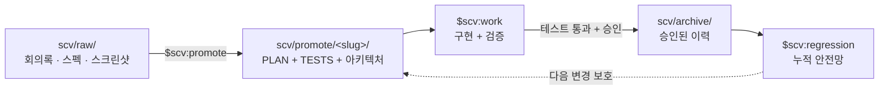

<div align="center">


# SCV for Codex

**Standard · Cowork · Verify**

**팀을 위한 프로세스 중심 Codex 플러그인. 모든 변경은 계획과 테스트를
동반하고, 승인된 테스트는 계속 회귀 안전망으로 남습니다.**

자료 투입 → Codex와 함께 계획으로 정제 → 구현과 검증 → 계획과 테스트
보관 → 이후 모든 변경을 지금까지 배포한 동작과 대조합니다.

[최신 릴리스](https://github.com/wookiya1364/scv-codex/releases/latest) ·
[English](./README.md) · [日本語](./README.ja.md)

</div>

---

## 빠른 시작

SCV에는 자연어로 말하면 됩니다. 예를 들어 **“SCV로 이 프로젝트 상태를
진단하고 다음 할 일을 알려줘”**라고 요청하면 Codex가 알맞은 스킬로
연결합니다.

```bash
# 1. 이 저장소를 Codex 플러그인 마켓플레이스로 추가합니다.
codex plugin marketplace add https://github.com/wookiya1364/scv-codex.git

# 2. 마켓플레이스에서 SCV를 설치합니다.
codex plugin add scv@scv-codex
```

설치한 스킬을 불러오도록 새 Codex 채팅 또는 CLI 세션을 시작한 다음
자연어로 요청하세요.

```text
SCV로 이 프로젝트 상태를 진단하고 다음 할 일을 알려줘.
```

정확한 스킬을 직접 선택하고 싶을 때만 `$scv:<name>`을 선택적으로
사용합니다.

```text
$scv:help "환불 버튼을 추가하고 싶어"
$scv:deck scv/promote/refund/PLAN.md
```

`$` 형식은 설치된 Codex 스킬을 고르는 선택자이며 shell 명령이 아닙니다.
`/scv:<name>`은 Claude Code의 slash command 표기이므로 이 plugin에서는
사용하지 않습니다.

### 플랫폼 사전 준비

- macOS: `brew install bash`로 Bash 4+를 한 번 설치합니다.
- Linux / WSL: 보통 Bash 4+가 기본으로 준비되어 있습니다.
- Windows PowerShell/cmd 네이티브 환경은 지원하지 않습니다. WSL 또는
  Git Bash를 사용하세요.
- `curl`, `git`, `jq`, `gh`(또는 `glab`)를 권장합니다. SCV는 누락된
  의존성을 임의로 추측하지 않고 명시적으로 알려줍니다.

## 5분 워크스루

시나리오: 결제 페이지에 환불 버튼 추가.

| 분 | 행동 | 결과 |
|---|---|---|
| 1 | 회의록, 스크린샷, 스펙을 `scv/raw/`에 넣기 | 원본 자료가 저장소 가까이에 남습니다. |
| 2 | `$scv:promote` | `scv/promote/<slug>/`에 `PLAN.md`, `TESTS.md`, `FEATURE_ARCHITECTURE.md`를 만듭니다. |
| 3 | `$scv:work <slug>` | Codex가 계획을 구현하고 테스트하며, 설정된 경우 UI 증거를 캡처합니다. |
| 4 | PR/MR 리뷰 | 계획, 테스트 결과, 외부 참조, 도식, 선택적 GIF/영상이 함께 전달됩니다. |
| 5 | 승인 후 archive | 계획이 `scv/archive/`로 이동하고 테스트가 `$scv:regression`에 합류합니다. |

어느 단계에서든 `$scv:help`가 저장소의 현재 상태를 읽고 다음 행동을
안내합니다.

## 흐름



archive는 묘지가 아닙니다. 6개월 뒤 아무도 기억하지 못하는 기능을 깨도,
그 기능의 테스트가 회귀를 잡습니다. 팀이 SCV를 오래 쓸수록 안전망이
두꺼워집니다.

## 스킬

이 표를 외울 필요는 없습니다. `$scv:help`가 저장소의 실제 상태에 맞춰
안내합니다.

| 스킬 | 하는 일 |
|---|---|
| **`$scv:help`** | 프로젝트 진단, 자유 형식 아이디어의 시작점 생성, 과거 archive 검색. |
| `$scv:status` | raw 자료, 진행 중 promote, epic 진척, workspace 모드, 수신 handoff 요약. |
| `$scv:promote` | `scv/raw/`를 승인 가능한 계획, 실행 가능한 테스트, Mermaid 아키텍처 도식으로 정제. |
| `$scv:work <slug>` | 계획 구현, 테스트, 증거 수집, 승인 요청, archive, PR/MR 준비. |
| `$scv:codegen <slug>` | 실험적 TDD-first 변형. TESTS가 case별 Red → Green을 이끌고 archive/PR 단계는 `$scv:work`에 인계. |
| `$scv:deck [<md>]` | 빠진 사실을 지어내지 않고 Markdown을 self-contained 기획 문서 또는 DeckUI 슬라이드로 변환. |
| `$scv:update` | 설치 버전과 릴리스를 비교하고 Codex marketplace 갱신 명령을 안내하는 read-only 검사. |
| `$scv:regression` | obsolete가 아닌 모든 archive의 실행 가능한 테스트 지시를 회귀 suite로 실행. |
| `$scv:report` | 명시적으로 설정된 Slack 또는 Discord 목적지에 단계 결과 게시. |
| `$scv:sync` | 새 SCV template을 표준 문서에 병합하고 active plan, 코드 scope, 테스트 사이 drift 탐지. |
| `$scv:install-deps` | 필수/선택 CLI를 탐지하고 동의를 거쳐 설치 안내. |
| `$scv:workspace` | nested multi-repo umbrella workspace 생성, 참가, 점검, 분리. |
| `$scv:handoff` | 다른 repo에 필요한 작업과 결정/맥락을 umbrella에 기록. push와 알림은 동의가 있어야 실행. |
| `$scv:set-models` | 이전 `SCV_MODEL_POLICY` 의도를 진단하고 실제 Codex model 설정을 설명. 설치된 스킬은 수정하지 않음. |

### Codex 모델 정책 제약

Claude Code는 명령별 model metadata를 허용했지만 Codex plugin skill은
skill별 model pinning을 제공하지 않습니다. model은 host, session 또는
project config 계층에서 선택됩니다. 따라서 `$scv:set-models`는 완전히
동일한 router가 아니라 **읽기 전용 호환성 진단**으로 동작합니다.

`recommended`, `all-opus`, `all-sonnet`, `all-haiku`, `session-default`의
의도를 해석하되 Anthropic model 이름을 OpenAI model 이름으로 추측해
치환하지 않습니다. `.codex/config.toml` 변경은 사용자가 명시적으로
요청하고, 지원 여부 확인·변경 preview·재확인을 거친 경우에만 수행합니다.

## 왜 SCV인가?

| 팀의 실패 모드 | SCV의 답 |
|---|---|
| AI diff를 믿기 전에 결국 사람이 직접 실행합니다. | `$scv:work`가 합의된 테스트를 실행하고 e2e 증거를 PR에 첨부할 수 있습니다. |
| 티켓, 계획, PR, 리뷰가 서로 다른 변경을 설명합니다. | `PLAN.md`가 단일 source이며 외부 티켓은 `refs:`로 연결합니다. |
| 과거 계획이 검색되지 않는 archive가 됩니다. | `supersedes:`, archive index, `$scv:help`, `$scv:regression`이 기록을 살아 있게 합니다. |
| 한 hosted service나 한 명의 maintainer에 묶입니다. | core는 Bash와 Markdown이며, 계획과 테스트는 읽고 fork할 수 있는 저장소 파일입니다. |

Codex가 주요 구현 파트너이고, 변경이 주로 feature/fix/refactor 크기이며,
깊은 사전 명세보다 누적 회귀 안전망을 중시하는 팀에 잘 맞습니다. 큰
initiative는 공통 `epic:` 아래 여러 slug로 나누세요.

`TESTS.md`가 backend, API, data, pure logic 동작을 정밀하게 정의한다면
`$scv:codegen`이 잘 맞습니다. 탐색적인 계획이나 시각적 의도를 테스트로
충분히 표현하기 어려운 UI 변경에는 `$scv:work`를 권장합니다.

## 멀티 레포

SCV는 기본적으로 single-repo입니다. frontend, backend, service 등 여러
repo로 나뉜 시스템에는 착탈 가능한 nested workspace를 선택적으로 씁니다.

- `$scv:workspace`로 umbrella 생성, child 참가, 분리를 수행합니다.
- `$scv:handoff`로 다른 repo에 필요한 작업을 명시적으로 선언합니다.
  SCV는 diff만 보고 cross-repo 요구를 추론하지 않습니다.
- handoff는 `open → claimed → done` 상태와 그 결정을 만든 대화 맥락을
  함께 보존합니다.
- push 성공 후 Slack/Discord 알림은 사용자의 동의가 있을 때만 보냅니다.
- 여러 `scv/`가 있는 monorepo는 context 또는 선행 인자로 module을
  선택합니다. 예: `$scv:status FE`, `$scv:work FE <slug>`.

workspace link를 제거하면 local plan을 migration하지 않고 독립 SCV
동작으로 돌아갑니다.

## 아키텍처와 안전

`PLAN.md`는 source of truth, `TESTS.md`는 실행 gate,
`FEATURE_ARCHITECTURE.md`는 시스템 관점입니다. Jira, Linear, Confluence,
Google Docs, Notion 자료는 복사하지 않고 `refs:`로 연결합니다. PR/MR
본문과 Slack/Discord 보고는 같은 계획에서 파생됩니다.

명시적으로 호출한 스킬은 작업을 위해 파일을 읽고 변경할 수 있지만, 외부
영향이 큰 행동은 드러나 있어야 합니다.

- archive에는 테스트 통과와 사용자 승인이 필요합니다.
- push, PR/MR 생성, 알림, dependency 설치, 영구 Codex config 변경은
  명시적 의도 또는 확인이 필요합니다.
- update와 model-policy 검사는 read-only입니다.
- archive는 immutable이며, 변경된 요구는 새 기록으로 supersede합니다.

프로젝트 `.env`에 `SCV_LANG=en|ko|ja`를 지정하면 생성 문서의 언어를
고정합니다. 없으면 최신 사용자 메시지의 언어를 따르고, 판단할 수 없으면
영어를 사용합니다.

## 업데이트

`$scv:update`로 read-only 버전 검사를 실행합니다. 명시적으로 갱신하려면:

```bash
codex plugin marketplace upgrade scv-codex
codex plugin add scv@scv-codex
```

그 뒤 새 Codex 세션을 시작하세요. 설치 plugin을 갱신해도 현재 repo의
`scv/`는 자동으로 바뀌지 않습니다. 새 template 병합은 `$scv:sync`로
별도 실행합니다.

## 공유 core와 릴리스

SCV 공통 동작은
[scv-core](https://github.com/wookiya1364/scv-core)에 있습니다. 이
저장소는 14개 Codex skill과 host capability mapping, Codex 전용 update 및
model-policy만 소유하는 얇은 adapter입니다.

모든 plugin release는 `plugins/scv/vendor/scv-core/`에 검증된 core를 고정해
포함합니다. 설치와 일반 실행 중에는 network로 core를 받지 않습니다.
`core.lock.json`, `SHA256SUMS`, source commit, 그리고 release에서 가져온
경우 검증한 tarball의 `artifact_sha256`으로 payload를 추적할 수 있습니다.

버전 세 가지는 독립적으로 관리합니다.

- root/plugin `VERSION`: `X.Y.Z-codex.N` 형태의 Codex wrapper release
- `vendor/scv-core/VERSION`: 공유 동작
- `vendor/scv-core/TEMPLATE_VERSION`: hydrate/sync가 관리하는 project 파일

maintainer는 `bash tools/vendor-core.sh --source ../scv-core`로 local
checkout을 시험하거나 `bash tools/vendor-core.sh --tag vX.Y.Z`로
checksum이 확인된 release를 고정할 수 있습니다.
`bash tools/verify-core.sh`는 payload, lock, API 호환성, action catalog,
adapter contract를 검사합니다. 정기 workflow는 `develop` 대상
`chore/core-*` PR만 열며 자동 merge나 승격을 하지 않습니다.
core release는 `scv-core-released` repository-dispatch event로 같은 검사를
시작할 수도 있습니다. 기본값은 built-in token이며, Actions의 PR 생성이
막힌 repo는 선택적으로 `SCV_CORE_SYNC_TOKEN` Actions secret을 설정합니다.

Core vendoring은 기본적으로 이 저장소의 정확한 vendor 목적지만 허용합니다.
테스트나 통제된 도구가 custom target을 쓰려면 명시적으로 opt-in해야 합니다.
updater는 manifest/metadata와 정확히 일치하는 tree만 받고, byte/type/mode
snapshot과 인접 owner lock을 유지하며, 열린 parent directory FD에서
same-filesystem no-replace rename으로 commit합니다. 실패와 catchable signal은
이전 tree를 정확히 복구합니다. rollback이 불완전하거나 process가 강제
종료되면 복구 증거를 보존하고 다음 update를 차단합니다.

Deck dependency, build, 생성된 deck JSON은 mutable runtime이므로 Core
source-payload SHA-256을 key로 하는 외부 cache에 둡니다. 교체 전에는 이전
vendor 또는 legacy `plugins/scv/DeckUI`의 허용된 runtime만 FD-stable
snapshot에서 cache로 additive하게 복사합니다. 원본은 수정하거나 삭제하지
않습니다. 이후 swap이 실패해도 이미 복사한 cache entry는 안전한 additive
상태로 의도적으로 남습니다. 다른 host가 먼저 채운 cache와 persistent
plugin-root source가 충돌하면 cache 전체를 authoritative하게 유지하고 legacy
source 전체를 건너뛰어 cross-host 부분 혼합을 막습니다. 기존 vendor 복구는
계속 strict하게 동작합니다.

project의 canonical index는 `scv/SCV.md`입니다. 기존 `scv/CLAUDE.md`나
`scv/CODEX.md`만 있는 project도 파일 생성 없이 그대로 읽습니다. legacy
state migration은 승인된 non-dry-run sync에서만 backup과 함께 수행하고,
내용이 다른 index가 함께 있으면 conflict로 중단합니다.

## 저장소와 브랜치 흐름

marketplace는 `.agents/plugins/marketplace.json`, plugin은 `plugins/scv/`
아래에 있습니다. upstream과 같은 영구 branch 흐름을 사용합니다.

```text
feat/* · fix/* · docs/* · chore/* · refactor/* · test/*
                              │
                              ▼
                           develop
                              │
                              ▼
                            stage
                              │
                              ▼
                             main
```

전체 정책은 [`.github/BRANCHING.md`](./.github/BRANCHING.md)를 참고하세요.

## 기원과 라이선스

SCV for Codex와
[SCV for Claude Code](https://github.com/wookiya1364/scv-claude-code)는
같은 SCV Core를 사용하는 얇은 host adapter입니다. shared-core 분리 전
릴리스 기록은 changelog에 upstream 역사로 보존합니다.

MIT © [wookiya1364](https://github.com/wookiya1364)
