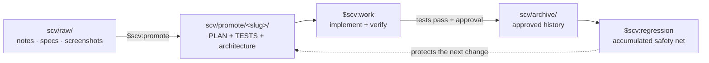

<div align="center">


# SCV for Codex

**Standard · Cowork · Verify**

**A process-first Codex plugin for teams. Every change ships with a plan and
tests, and every approved test stays in the regression suite.**

Drop materials → refine them with Codex → implement and verify → archive the
plan and tests → check every future change against what the team has shipped.

[Latest release](https://github.com/wookiya1364/scv-codex/releases/latest) ·
[한국어](./README.ko.md) · [日本語](./README.ja.md)

</div>

---

## Quick start

You can talk to SCV naturally. For example, ask **“Use SCV to diagnose this
project and tell me what to do next.”** Codex routes the request to the matching
skill.

```bash
# 1. Add the repository as a Codex plugin marketplace.
codex plugin marketplace add https://github.com/wookiya1364/scv-codex.git

# 2. Install SCV from that marketplace.
codex plugin add scv@scv-codex
```

Start a new Codex chat or CLI session so the installed skills are loaded, then
ask naturally:

```text
Use SCV to diagnose this project and tell me what to do next.
```

The `$scv:<name>` form remains available as an optional exact selector:

```text
$scv:help "I want to add a refund button"
$scv:deck scv/promote/refund/PLAN.md
```

The `$` form selects an installed Codex skill; it is not a shell command.
`/scv:<name>` is a Claude Code slash-command spelling and is not used by this
plugin.

### Platform prerequisites

- macOS: install Bash 4+ once with `brew install bash`.
- Linux and WSL: Bash 4+ is normally already available.
- Native Windows PowerShell/cmd is unsupported; use WSL or Git Bash.
- `curl`, `git`, `jq`, and `gh` (or `glab`) are recommended. SCV reports
  missing dependencies instead of silently guessing.

## Five-minute walkthrough

Scenario: add a refund button to the checkout page.

| Minute | Action | Result |
|---|---|---|
| 1 | Put notes, screenshots, or specs in `scv/raw/` | Source material stays close to the repository. |
| 2 | Run `$scv:promote` | SCV creates `PLAN.md`, `TESTS.md`, and `FEATURE_ARCHITECTURE.md` under `scv/promote/<slug>/`. |
| 3 | Run `$scv:work <slug>` | Codex implements the plan, runs its tests, and captures UI evidence when configured. |
| 4 | Review the PR/MR | The plan, test result, references, diagrams, and optional GIF/video travel together. |
| 5 | Approve and archive | The plan moves to `scv/archive/`; its tests join `$scv:regression`. |

At any point, `$scv:help` reads the current repository state and tells you what
comes next.

## The loop



The archive is not a graveyard. Six months later, a test written for a feature
that nobody remembers can still catch a regression. The longer the team uses
SCV, the stronger that safety net becomes.

### What the archive keeps besides the tests (Core 0.23.0+)

A plan says which route to take. `$scv:work` may take a better one when it finds
it — so the interesting question later is not what the plan said, but where the
work went instead, and why.

Archiving appends that to `scv/DECISIONS.md`:

```markdown
## [2026-08-12 10:49] sspark — Refund flow archived

- verdict: archived
- why: what this plan decided, and what the implementation taught us
- path delta: switched from a queue to a direct call — the queue only
  mattered for retries, and the API is already idempotent
- refs: scv/archive/20260812-sspark-refund-flow/PLAN.md
```

`path delta` is the line that would otherwise vanish with the session. When the
route matched the plan, it is one word: `as planned`.

### How `$scv:work` decides (Core 0.23.0+)

Four defaults apply while implementing, unless the plan's `Guardrails` say
otherwise: reuse what the codebase already has rather than adding a second way
to do the same thing; choose the simplest implementation that fully satisfies
the current requirement; keep one clear concern per component; and decide for
the long term where a decision is costly to reverse — data model, module
boundaries, published contracts.

SCV also leads with the short explanation. A plan you cannot follow cannot be
approved, so questions, plans, and progress reports start plain and go deeper
when you ask.

## Skills

You do not need to memorize this table; `$scv:help` routes you from the
repository's actual state.

| Skill | What it does |
|---|---|
| **`$scv:help`** | Diagnose the project, turn a free-form idea into a starting point, or search past archived work. |
| `$scv:status` | Summarize raw material, active promotes, epic progress, workspace mode, and incoming handoffs. |
| `$scv:promote` | Refine `scv/raw/` into an approved plan, executable tests, and Mermaid architecture diagrams. |
| `$scv:work <slug>` | Implement a plan, run its tests, collect evidence, request approval, archive it, and prepare a PR/MR. |
| `$scv:codegen <slug>` | Experimental TDD-first variant: TESTS drives Red → Green work case by case, then hands archive/PR work back to `$scv:work`. |
| `$scv:deck [<md>]` | Turn Markdown into a self-contained planning document or a DeckUI slide presentation without inventing missing facts. |
| `$scv:update` | Compare installed and released versions and show the Codex marketplace refresh commands; read-only. |
| `$scv:regression` | Run the executable test instructions from every non-obsolete archive entry. |
| `$scv:routine <name>` | List (`--list`), lint (`--lint <file>`), or run one maintenance routine defined under `scv/routines/`; scheduling stays host-owned. |
| `$scv:report` | Post a phase result to an explicitly configured Slack or Discord destination. |
| `$scv:sync` | Merge newer SCV templates into standard docs and detect drift between active plans, code scope, and tests. |
| `$scv:install-deps` | Detect required and optional CLIs and offer consent-gated installation guidance. |
| `$scv:workspace` | Create, join, inspect, or detach a nested multi-repository umbrella workspace. |
| `$scv:handoff` | Record cross-repository work, decisions, and context in the umbrella repository; push and notification remain consent-gated. |
| `$scv:set-models` | Inspect legacy `SCV_MODEL_POLICY` intent and explain the effective Codex model configuration; it never rewrites installed skills. |

### Codex model-policy limitation

Claude Code allowed command-level model metadata. Codex plugin skills do not
provide per-skill model pinning: the host, session, or project configuration
selects the model. Therefore `$scv:set-models` preserves migration behavior as
a **read-only compatibility diagnostic**, not as a byte-for-byte router.

It maps the intent of legacy policies (`recommended`, `all-opus`,
`all-sonnet`, `all-haiku`, `session-default`) without guessing Anthropic-to-
OpenAI model names. It changes `.codex/config.toml` only after an explicit
request, supported-model verification, a preview, and confirmation.

## Why SCV?

| Team failure mode | SCV's answer |
|---|---|
| An AI diff still has to be run manually before anyone trusts it. | `$scv:work` executes the agreed tests and can attach e2e evidence to the PR. |
| The ticket, plan, PR, and review comment describe different changes. | `PLAN.md` is the source of truth; external tickets stay linked through `refs:`. |
| Old plans become an unsearchable archive. | `supersedes:`, archive indexing, `$scv:help`, and `$scv:regression` keep history active. |
| The workflow depends on one hosted service or one maintainer. | The core is Bash and Markdown. Plans and tests remain readable, forkable repository files. |

SCV fits best when Codex is a primary implementation partner, changes are
usually feature/fix/refactor sized, and the team values an accumulating
regression net. For larger initiatives, split work into multiple slugs under a
shared `epic:` value.

Use `$scv:codegen` when `TESTS.md` precisely defines backend, API, data, or
pure-logic behavior. Prefer `$scv:work` for exploratory plans and UI-heavy
changes where tests cannot fully express visual intent.

## Multi-repository work

SCV is single-repository by default. A nested workspace is an opt-in,
detachable overlay for systems split across frontend, backend, and service
repositories.

- `$scv:workspace` creates an umbrella, joins a child, or detaches it.
- `$scv:handoff` explicitly declares work needed in another repository; SCV
  never infers cross-repository requirements from a diff.
- Handoffs move through `open → claimed → done` and retain the decision and
  conversation that produced them.
- A successful push can notify Slack or Discord only after consent.
- Monorepositories with multiple `scv/` directories can select a module by
  context or a leading argument, for example `$scv:status FE` and
  `$scv:work FE <slug>`.

Removing the workspace link returns a repository to ordinary standalone SCV
behavior without migrating its local plans.

## Architecture and safety

`PLAN.md` is the source of truth. `TESTS.md` is the executable gate.
`FEATURE_ARCHITECTURE.md` keeps the system view visible. External Jira, Linear,
Confluence, Google Docs, or Notion material is linked through `refs:` rather
than copied. PR/MR descriptions and Slack/Discord reports are derived from the
same plan.

SCV may read and change files while carrying out an explicitly invoked skill,
but consequential external actions stay visible:

- archive requires passing tests and user approval;
- push, PR/MR creation, notifications, dependency installation, and persistent
  Codex config changes require explicit intent or confirmation;
- update and model-policy inspection are read-only;
- archive entries are immutable; superseding work creates a new record.

Set `SCV_LANG=en|ko|ja` in the project `.env` to choose durable generated
language. Without it, SCV follows the latest user message and falls back to
English.

Core 0.22.0 adds a journal hook seam: two vendored templates capture free
conversation into `scv/journal/`. Registration is host-owned and documented
in [`plugins/scv/references/journal-hooks.md`](plugins/scv/references/journal-hooks.md);
the plugin registers no journal hooks of its own.

Since Core 0.23.0 that journal is **gitignored by default**. Two records, two
policies: `scv/conversations/` keeps the dialogs that became plans and is
committed, because the reasoning behind a plan belongs with the plan. The
journal is fed *every* prompt, including the ones that never became anything,
and whether that belongs in a repository depends on who can read it. To share
it, drop `scv/journal/` from `.gitignore` — but look at what has accumulated
first, because redaction is a heuristic. Once committed, restoring the ignore
rule does not untrack the files.

### The workspace guard (0.25.0-codex.2+)

A `PreToolUse` hook refuses two writes outright, so that a plan cannot appear
without the action that produces it:

- creating `PLAN.md`, `TESTS.md`, or `FEATURE_ARCHITECTURE.md` under
  `scv/promote/<slug>/` by hand. Editing one that already exists is always
  allowed — filling in `<TODO>` spots and moving `status:` along is the normal
  path.
- writing anywhere in the project outside `scv/`. Exempt: `*.md`, `.gitignore`,
  `.gitattributes`, `LICENSE`, and `.codex/config.toml`. `.env` deliberately is
  not — the sanctioned `.env` writes go through
  `plugins/scv/vendor/scv-core/core/scripts/env-set.sh` (Core 0.25.0+), a shell call that
  never reaches the write rule at all.

Both blocks lift for the rest of the session once a receipt exists. What mints
one is decided by registration, and this wrapper registers two
entries: `gate-bash` for shell tools and `gate-write` for `apply_patch` and the
editor tools. There is no separate mint entry, because Codex has no
skill-invocation event, so here the receipt comes from a shell call naming the
vendored `core/scripts/` directory or `plugins/scv/adapter/scripts/` — the hook
watches both since 0.28.0, so the adapter-routed actions (`$scv:update`,
`$scv:set-models`, `$scv:sync`) mint exactly like the Core ones. Every protocol
makes such a call before it writes anything, so running one skill clears the
block — but the model can
make that call too, which is why this is weaker than the Claude Code wrapper,
where the skill invocation itself mints. It closes the accidental path, not a
determined one.

The guard is inert in a repository that never adopted SCV, and it fails **open**:
any internal error prints one line to stderr and allows the write. To switch it
off, export `SCV_GUARD=off` in the environment Codex runs in — it is read from
the process environment only, never from a file, so nothing inside the repository
can exempt itself. `SCV_GUARD_RULE_B=off` keeps the plan rule and drops the
outside-write rule. The contract is
[`core/contracts/guard.md`](plugins/scv/vendor/scv-core/core/contracts/guard.md).

## Updating

Run `$scv:update` for a read-only version check. To refresh explicitly:

```bash
codex plugin marketplace upgrade scv-codex
codex plugin add scv@scv-codex
```

Start a new Codex session afterward. Updating the installed plugin does not
rewrite the current repository's `scv/`; run `$scv:sync` separately when you
want to merge newer templates.

## Shared core and releases

SCV behavior lives in
[scv-core](https://github.com/wookiya1364/scv-core). This repository is the
thin Codex adapter: it packages 15 Codex skills, maps host capabilities, and
owns only Codex-specific update and model-policy behavior.

Every plugin release includes a pinned, self-contained core under
`plugins/scv/vendor/scv-core/`. Installation and normal use never fetch core at
runtime. `core.lock.json`, `SHA256SUMS`, the source commit, and—when vendored
from a release—the verified tarball `artifact_sha256` make the embedded payload
auditable.

Three versions intentionally move independently:

- root/plugin `VERSION`: the Codex wrapper release, such as
  `X.Y.Z-codex.N`;
- `vendor/scv-core/VERSION`: shared behavior;
- `vendor/scv-core/TEMPLATE_VERSION`: project files managed by hydrate/sync.

Maintainers can test a local checkout with
`bash tools/vendor-core.sh --source ../scv-core`, or pin a checksummed release
with `bash tools/vendor-core.sh --tag vX.Y.Z`. `bash tools/verify-core.sh`
checks the payload, lock, API compatibility, action catalog, and adapter
contract. A scheduled check may open a `chore/core-*` PR to `develop`, but
never merges or promotes it automatically. Core releases may also trigger the
same check with the `scv-core-released` repository-dispatch event. The workflow
uses the built-in token by default; repositories that block PR creation from
Actions can configure an optional `SCV_CORE_SYNC_TOKEN` Actions secret.

Core vendoring accepts only the repository's exact vendor destination by
default. Tests and controlled tooling must explicitly opt into a custom target.
The updater validates the exact manifest/metadata tree, takes stable
byte/type/mode snapshots, holds an adjacent owner lock, and commits with
same-filesystem, no-replace renames through an opened parent directory.
Failures and catchable signals restore the prior tree exactly; an incomplete
rollback or uncatchable death preserves recovery evidence and blocks later
updates.

Deck dependencies, builds, and generated deck JSON are mutable runtime data,
so they live in an external cache keyed by the Core source-payload SHA-256.
Before replacement, allowed runtime from an older vendor or legacy
`plugins/scv/DeckUI` is copied additively from an FD-stable snapshot. The
sources are never edited or deleted. If the later swap fails, already copied
cache entries intentionally remain as a safe additive state. If a persistent
plugin-root source conflicts with a cache already populated by another host,
the cache is authoritative and the whole legacy source is skipped, preventing
partial cross-host mixing. Existing-vendor recovery remains strict.

The canonical project index is `scv/SCV.md`. Existing `scv/CLAUDE.md` and
`scv/CODEX.md` projects remain readable without mutation. Only an approved
non-dry-run sync migrates legacy state, with a backup; divergent indexes stop
as a conflict.

## Repository and branch flow

The marketplace lives at `.agents/plugins/marketplace.json`; the plugin lives
under `plugins/scv/`. Development follows the same permanent-branch flow as
the upstream project:

```text
feat/* · fix/* · docs/* · chore/* · refactor/* · test/*
                              │
                              ▼
                           develop
                              │
                              ▼
                            stage
                              │
                              ▼
                             main
```

See [`.github/BRANCHING.md`](./.github/BRANCHING.md) for the full policy.

Two vendored Core checks run beside the branch-flow one on every pull request
into `develop`, `stage`, or `main`:

- **Provenance** (`check-provenance.sh`, Core 0.25.0+) — a pull request that
  changes code must also add an archived plan at `scv/archive/<slug>/PLAN.md`.
  It reads `archive/` rather than `promote/` because the work action archives
  the plan before it opens the PR, so by then `promote/` is empty. Release-chain
  pull requests into `stage` or `main`, the sync bot's `chore/core-*` branches,
  and diffs that touch nothing but prose, `.gitignore`, `.gitattributes`,
  `LICENSE` and the `scv/` workflow directory are exempt. Anything
  else needs `[no-plan: <reason>]` in the title; an empty `[no-plan]` is refused,
  because the reason is the whole point of the marker.
- **Vendor** (`check-vendor-provenance.sh`, Core 0.27.0+) — a pull request that
  rewrites `plugins/scv/vendor/scv-core/` from a branch that is not the sync
  bot's is refused unless the title says `[manual-vendor: <reason>]`, the same
  shape as the marker above. Vendoring by hand is declared, not forbidden,
  because the two paths do not do the same work: the bot resolves the published
  release artifact and records both the canonical and the materialized hash,
  while a hand copy records whatever the working tree held, and nothing
  downstream can tell them apart afterwards.

Nobody walks that chain by hand. `gh workflow run promote.yml` opens each pull
request, waits until nothing has failed, nothing is still running, and GitHub
itself stops calling the pull request `BLOCKED`, then merges, tags, and
publishes — **[docs/RELEASING.md](docs/RELEASING.md)** is the procedure. One
caveat when the workflow file itself changes: `gh workflow run` dispatches
against the default branch, so `main`'s copy runs, and a fix to `promote.yml`
first takes effect on the release after the one that ships it.

## Origin and license

SCV for Codex and
[SCV for Claude Code](https://github.com/wookiya1364/scv-claude-code) are thin
host adapters over the same SCV Core. Historical release notes before the
shared-core split remain in the changelog as upstream history.

MIT © [wookiya1364](https://github.com/wookiya1364)
