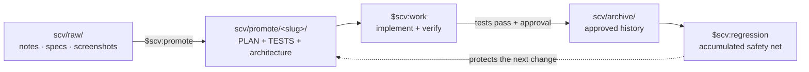

<div align="center">


# SCV for Codex

**Standard · Cowork · Verify**

**A process-first Codex plugin for teams. Every change ships with a plan and
tests, and every approved test stays in the regression suite.**

Drop materials → refine them with Codex → implement and verify → archive the
plan and tests → check every future change against what the team has shipped.

[Latest release](https://github.com/wookiya1364/scv-codex/releases/latest) ·
[한국어](./README.ko.md) · [日本語](./README.ja.md)

</div>

---

## Quick start

The only skill you need to remember is **`$scv:help`**. It diagnoses the
project and recommends the next SCV action.

```bash
# 1. Add the repository as a Codex plugin marketplace.
codex plugin marketplace add https://github.com/wookiya1364/scv-codex.git

# 2. Install SCV from that marketplace.
codex plugin add scv@scv-codex
```

Start a new Codex chat or CLI session so the installed skills are loaded, then:

```text
$scv:help
```

Examples:

```text
$scv:help "I want to add a refund button"
$scv:help "How did we handle refunds last quarter?"
```

SCV skills are explicit Codex skills. Use the literal `$scv:<name>` form; they
are not slash commands.

### Platform prerequisites

- macOS: install Bash 4+ once with `brew install bash`.
- Linux and WSL: Bash 4+ is normally already available.
- Native Windows PowerShell/cmd is unsupported; use WSL or Git Bash.
- `curl`, `git`, `jq`, and `gh` (or `glab`) are recommended. SCV reports
  missing dependencies instead of silently guessing.

## Five-minute walkthrough

Scenario: add a refund button to the checkout page.

| Minute | Action | Result |
|---|---|---|
| 1 | Put notes, screenshots, or specs in `scv/raw/` | Source material stays close to the repository. |
| 2 | Run `$scv:promote` | SCV creates `PLAN.md`, `TESTS.md`, and `FEATURE_ARCHITECTURE.md` under `scv/promote/<slug>/`. |
| 3 | Run `$scv:work <slug>` | Codex implements the plan, runs its tests, and captures UI evidence when configured. |
| 4 | Review the PR/MR | The plan, test result, references, diagrams, and optional GIF/video travel together. |
| 5 | Approve and archive | The plan moves to `scv/archive/`; its tests join `$scv:regression`. |

At any point, `$scv:help` reads the current repository state and tells you what
comes next.

## The loop



The archive is not a graveyard. Six months later, a test written for a feature
that nobody remembers can still catch a regression. The longer the team uses
SCV, the stronger that safety net becomes.

## Skills

You do not need to memorize this table; `$scv:help` routes you from the
repository's actual state.

| Skill | What it does |
|---|---|
| **`$scv:help`** | Diagnose the project, turn a free-form idea into a starting point, or search past archived work. |
| `$scv:status` | Summarize raw material, active promotes, epic progress, workspace mode, and incoming handoffs. |
| `$scv:promote` | Refine `scv/raw/` into an approved plan, executable tests, and Mermaid architecture diagrams. |
| `$scv:work <slug>` | Implement a plan, run its tests, collect evidence, request approval, archive it, and prepare a PR/MR. |
| `$scv:codegen <slug>` | Experimental TDD-first variant: TESTS drives Red → Green work case by case, then hands archive/PR work back to `$scv:work`. |
| `$scv:deck [<md>]` | Turn Markdown into a self-contained planning document or a DeckUI slide presentation without inventing missing facts. |
| `$scv:update` | Compare installed and released versions and show the Codex marketplace refresh commands; read-only. |
| `$scv:regression` | Run the executable test instructions from every non-obsolete archive entry. |
| `$scv:report` | Post a phase result to an explicitly configured Slack or Discord destination. |
| `$scv:sync` | Merge newer SCV templates into standard docs and detect drift between active plans, code scope, and tests. |
| `$scv:install-deps` | Detect required and optional CLIs and offer consent-gated installation guidance. |
| `$scv:workspace` | Create, join, inspect, or detach a nested multi-repository umbrella workspace. |
| `$scv:handoff` | Record cross-repository work, decisions, and context in the umbrella repository; push and notification remain consent-gated. |
| `$scv:set-models` | Inspect legacy `SCV_MODEL_POLICY` intent and explain the effective Codex model configuration; it never rewrites installed skills. |

### Codex model-policy limitation

Claude Code allowed command-level model metadata. Codex plugin skills do not
provide per-skill model pinning: the host, session, or project configuration
selects the model. Therefore `$scv:set-models` preserves migration behavior as
a **read-only compatibility diagnostic**, not as a byte-for-byte router.

It maps the intent of legacy policies (`recommended`, `all-opus`,
`all-sonnet`, `all-haiku`, `session-default`) without guessing Anthropic-to-
OpenAI model names. It changes `.codex/config.toml` only after an explicit
request, supported-model verification, a preview, and confirmation.

## Why SCV?

| Team failure mode | SCV's answer |
|---|---|
| An AI diff still has to be run manually before anyone trusts it. | `$scv:work` executes the agreed tests and can attach e2e evidence to the PR. |
| The ticket, plan, PR, and review comment describe different changes. | `PLAN.md` is the source of truth; external tickets stay linked through `refs:`. |
| Old plans become an unsearchable archive. | `supersedes:`, archive indexing, `$scv:help`, and `$scv:regression` keep history active. |
| The workflow depends on one hosted service or one maintainer. | The core is Bash and Markdown. Plans and tests remain readable, forkable repository files. |

SCV fits best when Codex is a primary implementation partner, changes are
usually feature/fix/refactor sized, and the team values an accumulating
regression net. For larger initiatives, split work into multiple slugs under a
shared `epic:` value.

Use `$scv:codegen` when `TESTS.md` precisely defines backend, API, data, or
pure-logic behavior. Prefer `$scv:work` for exploratory plans and UI-heavy
changes where tests cannot fully express visual intent.

## Multi-repository work

SCV is single-repository by default. A nested workspace is an opt-in,
detachable overlay for systems split across frontend, backend, and service
repositories.

- `$scv:workspace` creates an umbrella, joins a child, or detaches it.
- `$scv:handoff` explicitly declares work needed in another repository; SCV
  never infers cross-repository requirements from a diff.
- Handoffs move through `open → claimed → done` and retain the decision and
  conversation that produced them.
- A successful push can notify Slack or Discord only after consent.
- Monorepositories with multiple `scv/` directories can select a module by
  context or a leading argument, for example `$scv:status FE` and
  `$scv:work FE <slug>`.

Removing the workspace link returns a repository to ordinary standalone SCV
behavior without migrating its local plans.

## Architecture and safety

`PLAN.md` is the source of truth. `TESTS.md` is the executable gate.
`FEATURE_ARCHITECTURE.md` keeps the system view visible. External Jira, Linear,
Confluence, Google Docs, or Notion material is linked through `refs:` rather
than copied. PR/MR descriptions and Slack/Discord reports are derived from the
same plan.

SCV may read and change files while carrying out an explicitly invoked skill,
but consequential external actions stay visible:

- archive requires passing tests and user approval;
- push, PR/MR creation, notifications, dependency installation, and persistent
  Codex config changes require explicit intent or confirmation;
- update and model-policy inspection are read-only;
- archive entries are immutable; superseding work creates a new record.

Set `SCV_LANG=en|ko|ja` in the project `.env` to choose durable generated
language. Without it, SCV follows the latest user message and falls back to
English.

## Updating

Run `$scv:update` for a read-only version check. To refresh explicitly:

```bash
codex plugin marketplace upgrade scv-codex
codex plugin add scv@scv-codex
```

Start a new Codex session afterward. Updating the installed plugin does not
rewrite the current repository's `scv/`; run `$scv:sync` separately when you
want to merge newer templates.

## Repository and branch flow

The marketplace lives at `.agents/plugins/marketplace.json`; the plugin lives
under `plugins/scv/`. Development follows the same permanent-branch flow as
the upstream project:

```text
feat/* · fix/* · docs/* · chore/* · refactor/* · test/*
                              │
                              ▼
                           develop
                              │
                              ▼
                            stage
                              │
                              ▼
                             main
```

See [`.github/BRANCHING.md`](./.github/BRANCHING.md) for the full policy.

## Origin and license

SCV for Codex ports the behavior and documentation of
[SCV for Claude Code](https://github.com/wookiya1364/scv-claude-code).
Historical release notes before the Codex port remain in the changelog as
upstream history.

MIT © [wookiya1364](https://github.com/wookiya1364)
